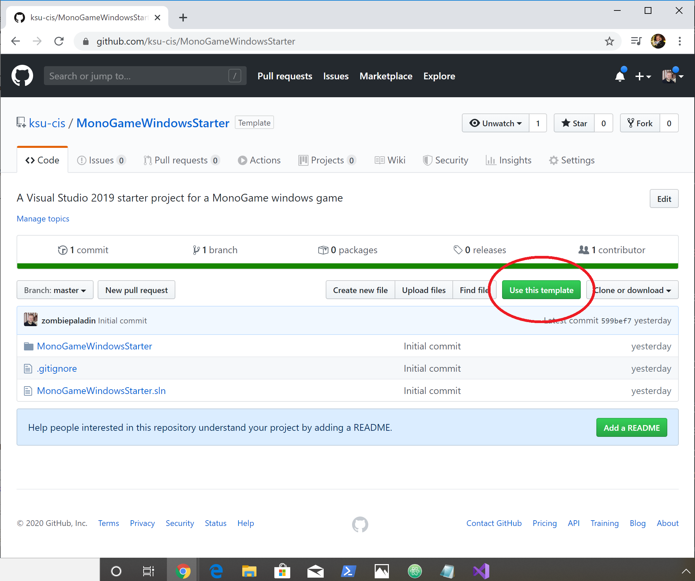

Cloning a git repository creates a local copy of the repository where you can make changes to the source code.  It maintains a link back to the repository it was cloned from, and you can push/pull code from that repository.  This is a very typical use-case for most software development.

However, when the project we are cloning is something like a _starter project_, where we simply want it as a starting point - we don't need its prior revision history.  Instead, we want to start from a blank slate.

## Repurposing a Clone
One approach that works with any Git repository is to clone the starter project, giving the cloned  repository a new name reflective of the new project, i.e.:

```
$ git clone https://github.com/ksu-cis/MonoGameWindowsStarter MyGame
```

Then, delete the `.git` folder from the new project directory:

```
$ cd MyGame
$ rm .git
```

And initialize a _new_ repository:

```
$ git init
```

And you have a new, _empty_ repository.  

You need to then add the files came with the starter to your source control, and commit their current state:

```
$ git add .
$ git commit -a -m "Initial commit"
```

Finally, you can [upload your repository to GitHub]({{site.baseurl}}).

## GitHub Templates

Repositories hosted on GitHub have an alternative option.  If the repository owner has marked the repository as a [template repository](https://github.blog/2019-06-06-generate-new-repositories-with-repository-templates/), its home page will show a __Use this Template__ button next to the __Clone or download__ button.  



This will take you to a screen where you can create a new repository under your own GitHub account from the starter project:


Then you can create a local repository by cloning this project from the command line, or through Visual Studio's Team Explorer.  The link for the project can be found in the __clone or download__ dropdown on your new repository page.


At the command line:

```
$ git clone https://github.com/zombiepaladin/ideal-succotash.git
```

Or through Visual Studio:


Because this project was cloned from your GitHub repository, it will already that repository configured as the remote __origin__ repository, so you can [pull]({{site.baseurl}}) and [push]({{site.baseurl}}) changes from and to it.

## Download A Zip from GitHub

A third option when working with a GitHub repository that is _not_ a template repository (or one that is) is to download a ZIP file from the __clone or download__ dropdown. The extracted project folder will not have a `.git` directory - it is just the project files.  Then you can create a new repository in its directory:

```
$ git init
```

And then add the files came with the starter to your source control, and commit their current state:

```
$ git add .
$ git commit -a -m "Initial commit"
```

Finally, you can [upload your repository to GitHub]({{site.baseurl}})
