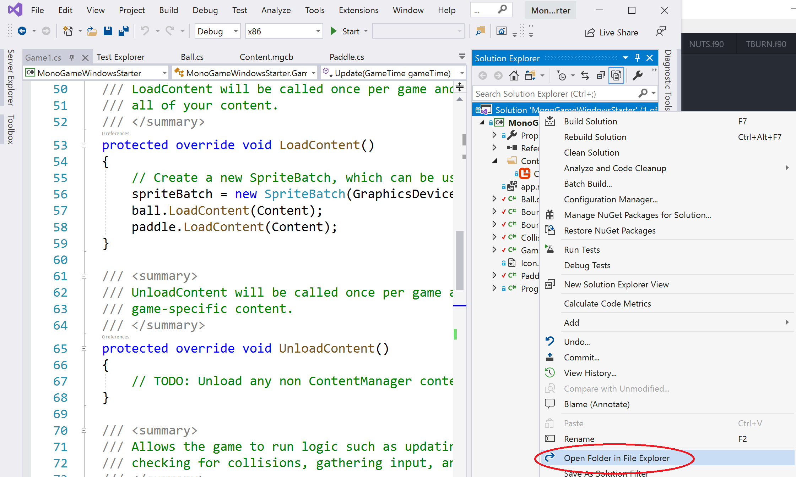
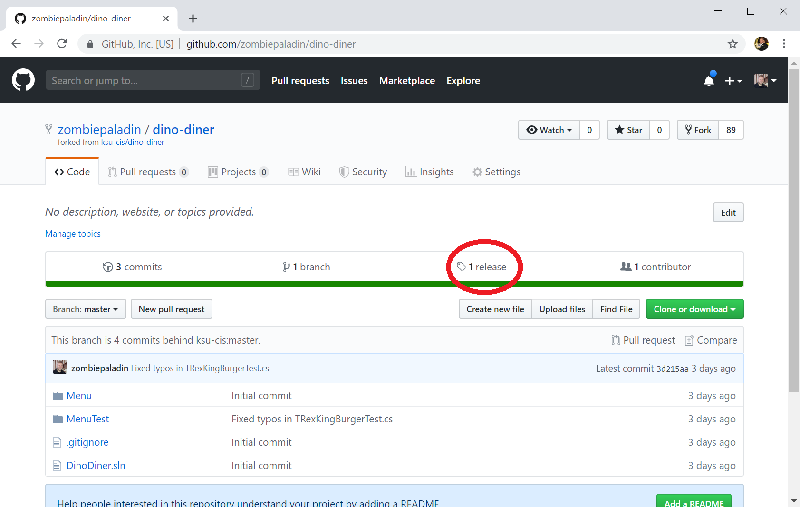
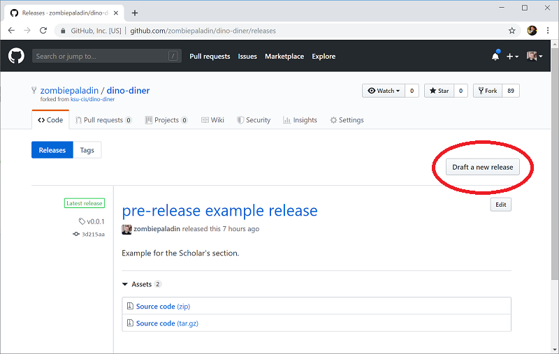
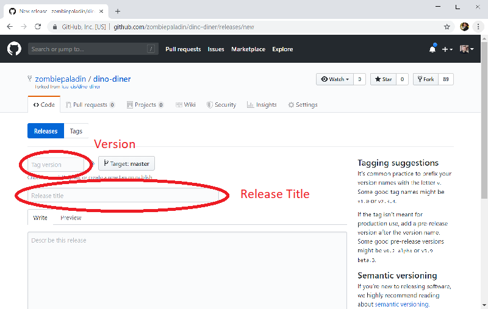
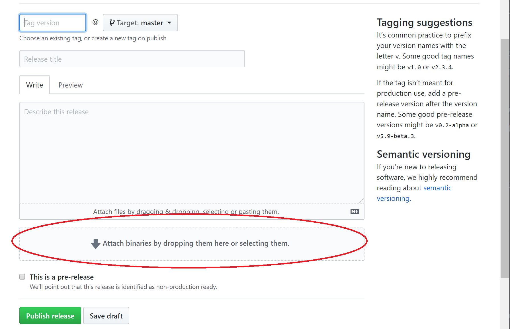
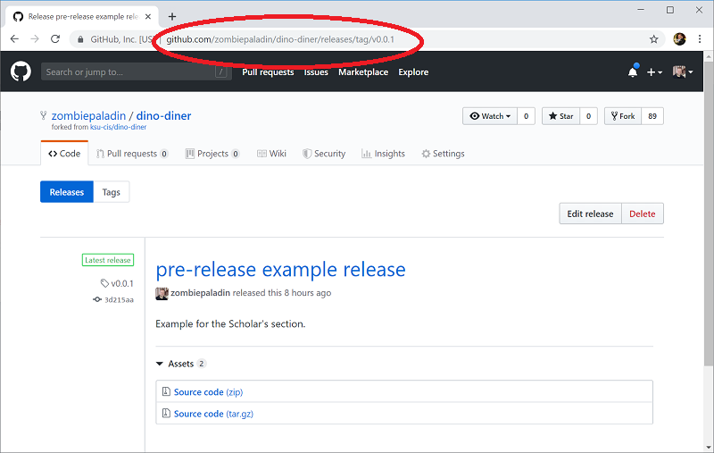

When you are ready to turn in an assignment, you will need to create a _release tag_.  A _tag_ is nothing more than a specially named commit, and a _release_ is a special tag created on GitHub to mark a specific version of the software.

## Step 1 - Build your project and zip the binaries
Build your project.  Then navigate to your build folder.  An easy way to accomplish this is to use the **Open Folder in File Explorer** in the Solution context menu - right click the solution in Visual Studio's Solution View, and select the option.



Then drill down in File Explorer to reach your game project's binaries folder: __Your Game Folder/bin/Windows/x86__.  Zip the __Release__ folder, as this folder contains all the files needed to run your game on a PC.  You'll need this zip file for step 4.

## Step 2 - Make sure _All_ your code is on GitHub
Since releases are created on GitHub, it is important to make sure you've [committed your changes]({{site.baseurl}}) and [pushed them to origin]({{site.baseurl}}) before you create the release.  You can check that all changes have been committed and pushed with the command:

```
$ git status
```

If you see these messages:

```
Your branch is up to date with 'origin/master'.

nothing to commit, working tree clean
```

Then you are good to go.  On the other hand, if you get the message `Your branch is # commits ahead of 'origin/master'`, then you need to [push to master]({{site.baseurl}}), and if any files are listed as uncommitted, you first need to [commit them]({{site.baseurl}}).

## Step 3 - Navigate to the Releases on GitHub
Next, open your repository on Github.  Towards the top of the page you should see a tab named "releases".  Click it.



This will load the releases page for your repository.  On it you will see a button "Draft New Release".  Click it.



## Step 4 - Complete the Release Form
You will need to fill out the release form, specifically the version and title, and then click the "Publish Release" button.



Releases use [_semantic versioning_](https://semver.org/), a numbering system that uses three numbers separated by periods (i.e. version 3.4.2).  The first number is the _major_ version - a change in this number indicates a major change in the associated software, i.e. a redesigned interface, a change in what methods are available, etc.  The second number is the _minor_ version.  It indicates small feature additions to the software.  Finally, the third number is the _patch_ version, and this one indicates a change that is typically a bug fix or security fix.  Each number _rolls over_ like the seconds and minutes on a clock when the next version number is increased, i.e. you would go from version 2.7.23 to 3.0.0, or 4.3.12 to 4.4.0.  You should decide a release number appropriate for your project.

Releases also get a human-readable name.  For this class, you should use the assignment name as the release name, i.e. Assignment 1 for your first release.

You'll want to include any instructions for playing your game in the description - i.e. if your game uses arrow keys for movement, you should describe how to move and what the general goal is.

Finally, in the **Attach binaries by dropping or selecting them** section, you'll want to attach the Zip file created in step 1.

 

## Step 4 - Submit your Release URL on K-State Online
Once you have finished creating the release, GitHub should take you to the release page.  You can also navigate there by clicking the "releases" tab on your GitHub repository's landing page and then clicking the specific release.  Copy the URL of this page; it is what you will submit on K-State Online.


