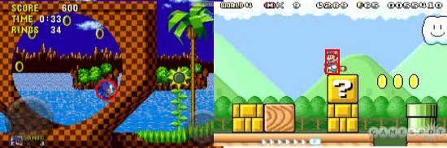
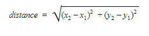
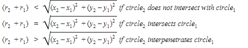
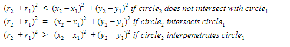
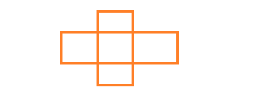

At the heart of every game design is interaction - interaction between the player and a simulated game world.  This simulation imposes rules about how interaction is allowed to unfold, and in nearly all cases is built upon the mechanism of collision detection - detecting when one sprite touches or overlaps another within the game world.

Consider the basic mechanics of many classic games:
* In _Space Invaders_, bullets from the player’s turret destroy invading aliens, while alien’s bullets chew away the player’s shields and kill the player if they strike him or her.
* In the _Super Mario Bros._ series, jumping on an enemy squishes them - yet letting the enemy walk into Mario will kill him.
* In the _Sonic_ series, running over an enemy while spinning will destroy that enemy, freeing the trapped animal within, yet walking into the same enemy will hurt Sonic.
In each of these examples, the basis for interacting with other sprites is collision detection, and, depending on the nature of the collision, different in-game effects are triggered.

So how do we detect collisions between two sprites?  There are several strategies:

## Collision Shapes
Perhaps the most straightforward approach is the use of a _collision shape_ (also called a _collision primitive_ or _bounding area_).  This is a simplified representation of the sprite - simplified in a way that allows for easy mathematical detection of collision events.  The collision shape mimics the shape of the overall sprite:



Thus, circular sprites are represented by circles, and rectangular sprites by rectangles.  Very small sprites (like circles) can be approximated by a point.  Circles, rectangles, and points are by far the most common of 2D collision shapes, because the mathematics involved in detecting collisions with these shapes is very straightforward, and because the memory required to store these collision shapes is minimal (two numbers for a point, three numbers for circle, and four for a rectangle):

```csharp
public struct BoundingCircle
{
  public float X;
  public float Y;
  public float Radius;
}

public struct BoundingRectangle
{
  public float X;
  public float Y;
  public float Width;
  public float Height;
}

public struct BoundingPoint
{
  public float X;
  public float Y;
}
```

Bounding points are typically defined with a single point (x & y). Bounding circles are typically defined with a center point (x & y) and a radius.  Bounding rectangles are typically defined by a position (x & y) and a width and height - although an alternate definition using left, top, right, and bottom values is also sometimes used.  Also, while the position often refers to the upper left corner, it can also be set in the center of the rectangle, or at the middle bottom, or anywhere else that is convenient - as long as the positioning is consistent throughout the game code, it won’t be an issue.

These values can be stored as either an integer or floating point number. When rendered on-screen, any fractional values will be converted to whole pixels, but using floats can preserve more detail until that point.

### Circle on Circle Collisions
Perhaps the easiest of all shapes to test for collisions is a collision between two circles.  Remember a circle is defined as all points that are <radius> distance from the <center>.  For two circles to collide, some of these points must fall within the region defined by the other.  If we were to draw a line from center to center:


We can very quickly see that if the length of this line is greater than the sum of the radii of the circle, the two circles do not overlap.  We can calculate the distance between the circles using the distance formula:



This can then be compared to the sum of the two circle’s radii, giving us an indication of the relationship between the two shapes:



However, computing the square root is a costly operation in computational terms, so we will typically square both sides of the equation and use a comparison of the squares instead:



From these inequalities we can very easily write a test for determining if our shapes collide.

```csharp
public bool CheckForCollision(BoundingCircle a, BoundingCircle b)
{
  return Math.Pow(a.radius + b.radius, 2) <= Math.Pow(a.x - b.x, 2) + Math.Pow(a.y - b.y, 2);
}
```

### Point on Point Collisions

Because a point has no size, two points collide only if they have the same x and y values.  In other words, two points collide if they are the same point.  This is simple to implement in code:

```csharp
public bool CheckForCollision(BoundingPoint a, BoundingPoint b)
{
  return a.x == b.x && a.y == b.y;
}
```

### Rectangle on Rectangle Collisions

There are many possible algorithms to use in detecting when a rectangle collides with another rectangle, each with its own strengths and weaknesses.  Again, we can turn to a graphical representation to help us generate our test:

[Rectangle on rectangle collisions](assets/rectangle-on-rectangle-collisions.png)

From this first image, we might assume that two rectangles collide if one of their corners falls within the other.  Thus, we might think that simply checking if any of the corners of one rectangle fall within the other would give us our result.  But that overlooks one important case:



As this example makes clear, the important concept is that one rectangle must overlap the other rectangle in two dimensions (both the X and the Y) for a collision to occur.  Thus, we could check:

Horizontally:
* if a's left side falls within b's horizontal span
* or if a's right side falls within b's horizontal span
* or if b's left side falls within a's horizontal span
* or if b's right side falls within a's horizontal span

and vertically:
* if a's top side falls within b's vertical span
* or if a's bottom side falls within b's vertical span
* or if b's top side falls within a's vertical span
* or if b's bottom side falls within a's vertical span

That is a lot of cases!  It also makes for a monster boolean expression, an does a lot of operations.  As with many boolean expressions, we can instead consider the negation - proving that the two rectangles _do not overlap_.  This is far simpler; all we need to prove is that the two do not overlap horizontally or vertically.  Thus we can check:

Horizontally:
* if a is to the left of b
* or if a is to the right of b

or Vertically:
* if a is above b
* or if a is below b

```csharp
public bool Collides(BoundingRectangle a, BoundingRectangle b)
{
    return !(a.x + a.width <= b.x    // a is to the left of b
          || a.x >= b.x + b.width     // a is to the right of b
          || a.y + a.height <= b.y    // a is above b
          || a.y >= b.x + b.height)   // a is below b
}
```
