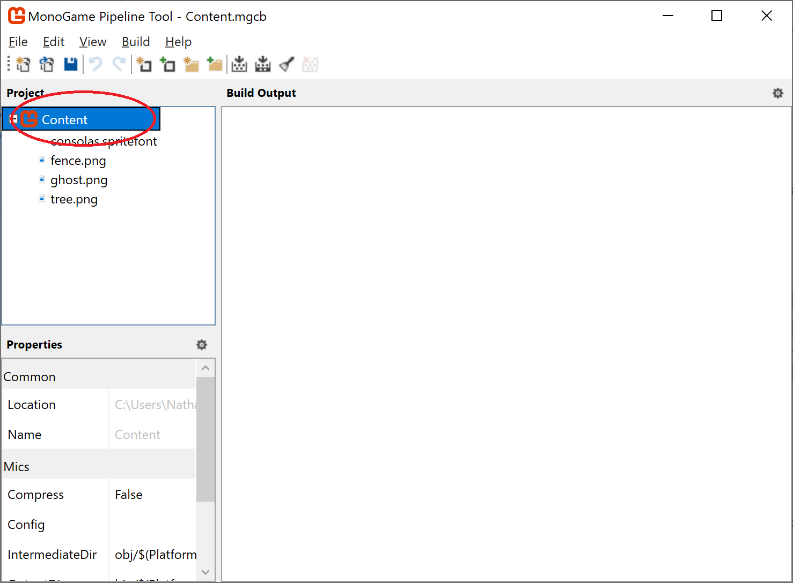
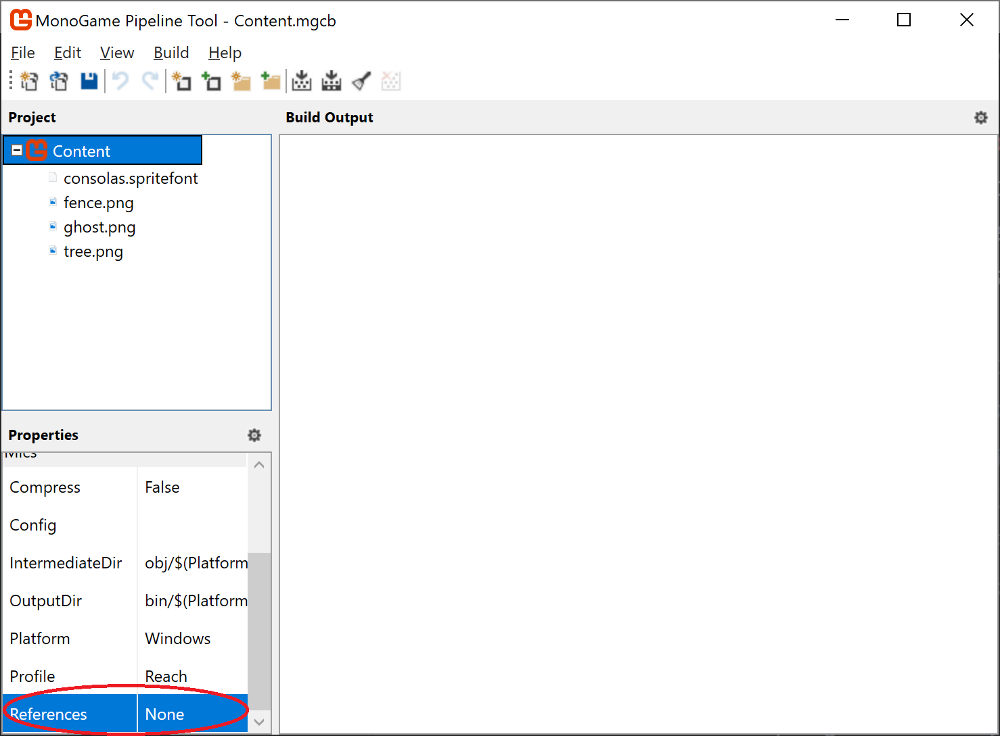
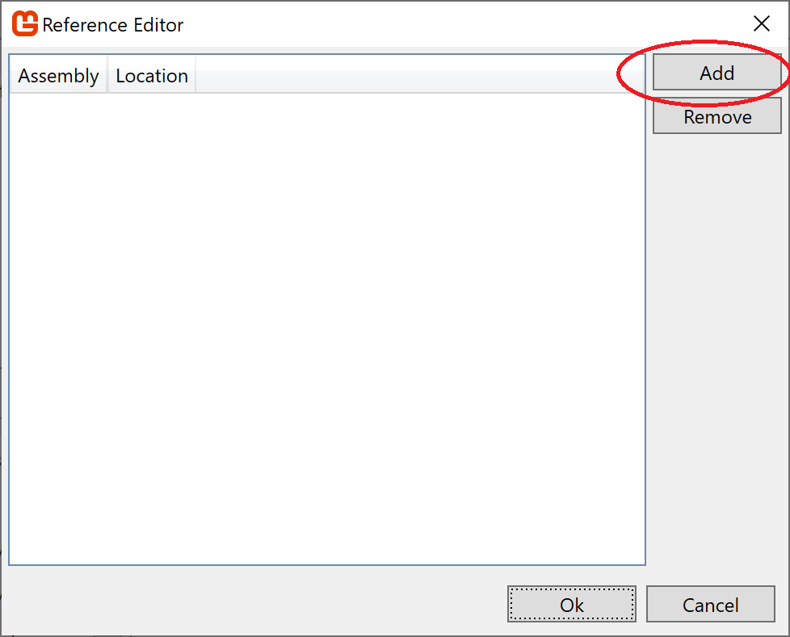

While the Content Pipeline is a very powerful tool on its own, it only provides content importers and processors for those files that the creators of XNA anticipated.  Knowing that additional file formats would be encountered (or created) by developers, the XNA team made the pipeline _extensible_, allowing you to create your own custom pipeline tools to handle your own file types.

## Content Pipeline Extension Project
This begins by creating a Content Pipeline Extension Project using the template installed with MonoGame.  This template includes an example Importer and Processor Classes, which you can use as a starting point.

> Note: It is possible that the template project may not correctly reference the location of MonoGame.Framework.Content.Pipeline.dll.  If so, you will need to manually re-target it by clicking the "references" and clicking "add reference" from the context menu, and then browsing to the DLL's location.  By default, the MonoGame installer puts it in C:\Program Files (x86)\MSBuild\MonoGame\v3.0\Tools\MonoGame.Framework.Content.Pipeline.dll

## Linking the Extension Project to the Content Pipeline Tool
With the extension project built, open the Content Pipeline Tool, and select the root of the content tree:

Then scroll down in the _Properties_ pane until you see the _References_ property:

Click its value (_None_ in this case) to open the _Reference Editor_.

In the reference editor, click the _Add Button_ and browse to the location of your extension project's DLL.  This will typically be up two directories (your solution directory) and then into your extension project directory + _/bin/debug/[project name].dll_   You can use either the Debug or Release Build.
